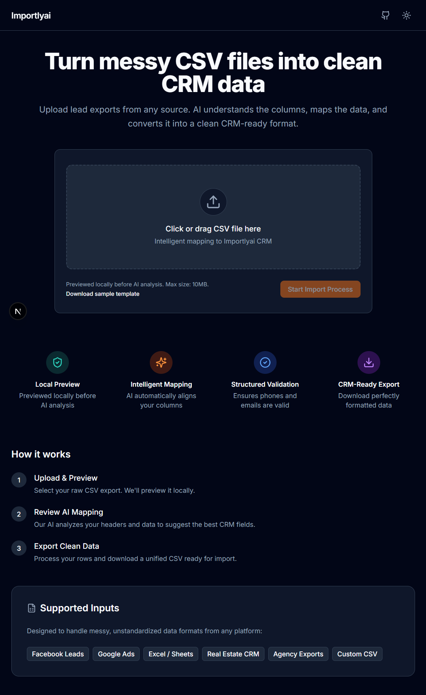
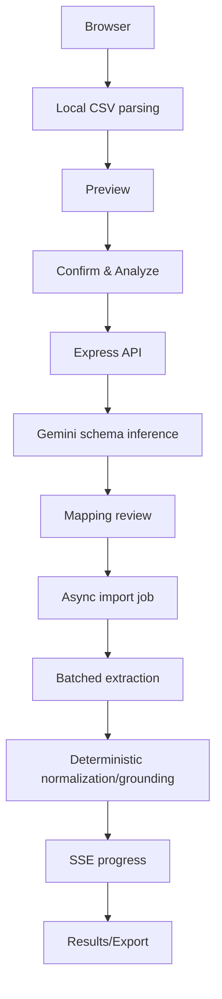

# Importlyai CRM Importer

An AI-powered CSV-to-CRM importer that converts messy, inconsistent lead exports into validated CRM-ready records.



## 1. What does this project do?

Importlyai CRM Importer is a robust pipeline that safely ingests unstandardized data formats—such as exports from Facebook Leads, Google Ads, or custom Real Estate databases—and maps them seamlessly to a unified CRM schema.

## 2. Why is it technically difficult?

A basic CSV importer assumes a perfectly aligned schema: `Name -> name`, `Email -> email`, `Phone -> phone`.
In reality, messy exports contain:
- Unpredictable column headers (`Customer`, `Lead Name`, `Contact Person`, `Mail ID`, `Phone 1`, `WhatsApp`)
- Heterogeneous schemas combining multiple data sources
- Ambiguous or contaminated fields (e.g., status flags in name columns)
- Multiple contacts collapsed into single rows
- Messy date formats
- Large files that can crash browser tabs

This project tackles these issues by combining **LLM-driven semantic schema inference** with a **deterministic validation pipeline** that handles extraction errors, prompt injections, partial batch failures, and memory limits securely.

## 3. What makes this implementation better than a basic CSV parser?

### Hybrid AI + Deterministic Pipeline

We do **not** blindly trust the LLM. Sending raw CSVs directly to an AI is brittle, unscalable, and prone to hallucinations or silent omissions. Instead, we use a hybrid pipeline:

1. **Local CSV Parsing:** Data is chunked and parsed in the browser natively (zero API calls).
2. **AI Schema Inference:** Gemini infers column relationships using a semantic map.
3. **User Mapping Review:** The user confirms the AI’s mapping.
4. **Compact Batch Extraction:** Data is extracted safely in small batches.
5. **Structured JSON Schema:** Gemini is constrained to exact output shapes.
6. **Zod Validation:** Strict type enforcement ensures validity.
7. **Deterministic Contact Discovery:** Fallbacks accurately isolate and route primary emails/phones vs. secondary data.
8. **Normalization & Source Grounding:** We guarantee hallucinated fields are stripped.
9. **Enum Enforcement:** CRM status codes are safely cast.
10. **Failure Isolation:** One malformed row does not crash a 500-row batch.
11. **CSV-Safe Export:** Data is round-trip sanitized for safety.

### AI Reliability & Engineering Defenses
- **Structured JSON Output & Bounded Schema:** Gemini is locked into strict `response_mime_type: "application/json"`.
- **Sequential Request Control:** Protects free-tier rate limits.
- **Malformed JSON Handling & Retry Behavior:** Recovers automatically from invalid LLM responses.
- **MAX_TOKENS Detection:** Dynamically falls back and splits batches when AI output exceeds token limits.
- **Prompt Injection Isolation:** Adversarial data is held back from the LLM context to prevent poisoning.

### Edge Cases Handled

| Problem | Engineering Solution |
|---|---|
| Multiple emails | First becomes primary; extras preserved deterministically in `crm_note` |
| Multiple phones | First becomes primary; extras preserved deterministically in `crm_note` |
| Phone mapped to state | Deterministic contamination guards reject the invalid mapping |
| AI invents "unknown state" | Placeholder normalization + source grounding clears it |
| Prompt injection in remarks | Held back from LLM prompt and preserved deterministically |
| Malformed Gemini JSON | Parse diagnostics + retry + failure isolation |
| AI hits `MAX_TOKENS` | Batch splitting and deterministic fallback |
| No email and no phone | Record safely skipped (un-contactable) |

### Large File Support
- **10,000 Row Limit:** Supported efficiently.
- **Incremental Parsing:** Papa Parse chunking (> 512KB) parses rows without freezing the UI.
- **Zero API Calls Before Confirmation:** The browser parses everything locally up front.

## 4. Architecture



**Stack:**
- **Frontend:** Next.js (Standalone)
- **Backend:** Node.js / Express API
- **AI Engine:** Google Gemini
- **Types:** Shared Zod package (`@groeasy/shared`)

## 5. Can I inspect the code quickly?

### Repository Structure
```text
.
├── apps
│   ├── api (Express backend)
│   └── web (Next.js frontend)
├── packages
│   └── shared (Zod schemas / TS Interfaces)
├── data
│   ├── test-data (CSV fixtures: valid, messy, adversarial)
│   └── evaluation (Benchmark scripts)
├── docker-compose.yml
└── Dockerfile (API & Web)
```

## 6. Testing & Benchmarks

Our test strategy operates on three layers:
1. **Deterministic Automated Tests:** We maintain **180 tests** across **16 test files** ensuring pure logic (parsing, normalization, batching) works flawlessly.
2. **Manual/Browser E2E:** Live flow verification.
3. **Live Gemini Benchmark:** Automated extraction tests against real data fixtures.

**Current Benchmark Output:**
- 5 fixtures passed (100% aggregate)
- 0 failed, 0 errored
*(Note: LLM benchmarks can vary across model versions. 100% represents current fixture status, not universal accuracy on all possible real-world CSVs.)*

## 7. Security & AI Safety
- **No secrets in frontend:** The Gemini API key remains strictly on the backend.
- **No secrets baked into Docker:** Standalone images are built cleanly.
- **Untrusted data isolation:** CSV data is treated as unstandardized raw data; strict Zod validation sanitizes it before internal CRM use.

## 8. Can I try it?

### Deployment Status
**Deployment pending final regression phase.**

### Local Setup (Docker)
The easiest way to run this project is via Docker Compose. Both the frontend and backend run in unprivileged non-root containers.

1. Configure your environment:
```bash
cp .env.example .env
```
*(You MUST edit `.env` to replace `your_gemini_api_key_here` with a real Gemini key)*

2. Build and boot:
```bash
docker compose up --build
```

**Services:**
- **Frontend:** [http://localhost:3000](http://localhost:3000)
- **API:** [http://localhost:4000](http://localhost:4000)
- **Health:** [http://localhost:4000/health](http://localhost:4000/health)

*(Note: `NEXT_PUBLIC_API_URL` is baked in at build time. Changing it requires a web image rebuild.)*

### Local Setup (Non-Docker)
1. Ensure Node.js >=20 is installed.
2. Install workspace dependencies:
```bash
npm ci
```
3. Configure environment:
```bash
cp .env.example .env
```
*(Add your valid Gemini key)*
4. Start both applications:
```bash
npm run dev
```

## Environment Variables

| Variable | Scope | Type | Default | Description |
|---|---|---|---|---|
| `GEMINI_API_KEY` | API Runtime | **Required** | `your_gemini_api_key_here` | Secret key for AI extraction |
| `GEMINI_MODEL` | API Runtime | Optional | `gemini-3.1-flash-lite` | Model identifier |
| `AI_CONCURRENCY` | API Runtime | Optional | `1` | Max simultaneous AI requests |
| `PORT` | API Runtime | Optional | `4000` | Backend port |
| `FRONTEND_URL` | API Runtime | Optional | `http://localhost:3000` | CORS Origin |
| `BATCH_SIZE` | API Runtime | Optional | `25` | Rows processed per AI batch |
| `NEXT_PUBLIC_API_URL`| Web Build-Time| **Required** | `http://localhost:4000` | Static API target |

## Core API Endpoints

- `GET /health` - Service healthcheck
- `POST /api/csv/analyze` - Parses columns and infers CRM mapping via AI
- `POST /api/import/start` - Enqueues background extraction job
- `GET /api/import/:jobId/progress` - Server-Sent Events (SSE) tracking
- `GET /api/import/:jobId/result` - Fetches completed normalization results

## Engineering Decisions & Trade-offs
- **Stateless Architecture:** A database is unnecessary for this assignment context; keeping it stateless vastly simplifies deployment.
- **Hybrid AI:** Deterministic rules protect high-confidence fields; AI is reserved purely for handling semantic ambiguity.
- **Sequential Concurrency (`AI_CONCURRENCY=1`):** Ensures we gracefully respect free-tier Google API rate limits without overwhelming the system.
- **Human-in-the-loop:** The mapping review forces a user confirmation step before an expensive large AI extraction begins.
- **Memory Retention:** Rows remain in-memory (limited to 10k rows) due to the preview/import architecture constraint without a database.

## Limitations
- AI output inherently depends on model availability, quota, and latency.
- Current hard limit of 10,000 rows.
- The full parsed dataset is retained in browser memory.
- There is no persistent import history (refreshing loses data).
- The AI accuracy benchmark is representative, not a universal guarantee.
- Dockerized AI E2E is pending until a valid key is tested in the runtime.

---
**Position Applied For: Intern**
