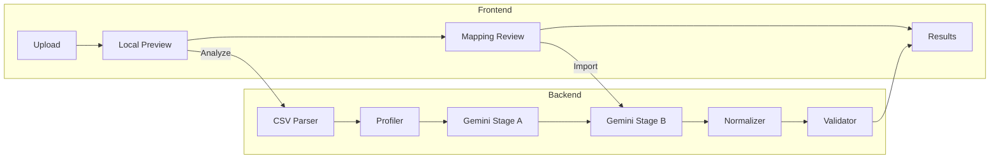

# GrowEasy CRM CSV Importer

AI-powered universal CRM CSV importer that intelligently converts messy lead data from any source into the GrowEasy CRM schema.

**Position applied for:** Intern

**Live demo:** _[Add deployment URL]_

## Value Proposition

Upload almost any CSV — Facebook leads, Google Ads exports, real estate CRMs, sales reports — and get clean, validated CRM records. The system uses a **hybrid AI + deterministic pipeline** where Gemini resolves semantic ambiguity and code enforces guarantees.

## Repository Structure

```
├── apps/
│   ├── web/          # Next.js frontend (App Router, Tailwind)
│   └── api/          # Express backend (TypeScript)
├── packages/
│   └── shared/       # Shared types, enums, Zod schemas
├── test-data/        # Test CSV datasets (valid/, messy/, adversarial/, etc.)
├── scripts/          # AI evaluation harness
└── docs/             # Architecture documentation
```

## Architecture Overview



See [docs/architecture.md](docs/architecture.md) for the full pipeline diagram.

## Why Hybrid AI + Deterministic Processing?

**The hard problem is semantic understanding, not CSV parsing.**

- **Deterministic code** handles: parsing, profiling, email/phone regex, date formats, enum validation, Zod schemas, batch splitting
- **Gemini AI** handles: column meaning inference, CRM status semantics, data source mapping, ambiguous field extraction

This avoids the anti-pattern of sending raw rows blindly to an LLM.

## Import Flow

1. User uploads CSV → browser previews locally (no AI call)
2. User clicks "Confirm & Analyze" → backend profiles dataset
3. Gemini infers column-to-field mappings (Stage A)
4. User reviews mappings, adjusts if needed
5. User confirms → backend processes in batches (Stage B)
6. Deterministic normalization + validation
7. Results: imported records, skipped records with reasons, CSV export

## AI Pipeline

| Stage | Purpose | Input | Output |
|-------|---------|-------|--------|
| A | Schema Inference | Headers, profiles, samples | Column mappings + confidence |
| B | Batch Extraction | Confirmed mappings + rows | CRM fields per row |

Prompts are isolated in `apps/api/src/ai/prompts/` with explicit injection defense.

## Prompt Engineering Strategy

- Separate prompt modules (not inline in routes)
- Clear sections: role, objective, schema, enums, rules, output contract
- CSV data delimited and marked as untrusted
- Structured JSON output via Gemini SDK + Zod validation

## Batch Processing

- Default batch size: 25 rows
- Concurrency: 2 parallel batches
- Retries: 3 with exponential backoff + jitter
- Partial failures don't destroy successful work

## Validation Strategy

- All AI responses validated with Zod
- CRM records must have valid email OR phone
- Enum fields validated against allowed values
- Empty strings for unknown fields (never null/undefined)

## Local Setup

### Prerequisites

- Node.js 20+
- Gemini API key

### Installation

```bash
git clone <repo-url>
cd groeasy-crm-importer
npm install
```

### Environment Variables

```bash
# Root / apps/api/.env
cp .env.example apps/api/.env
# Add your GEMINI_API_KEY

# Frontend
cp apps/web/.env.local.example apps/web/.env.local
```

### Development

```bash
# Start both frontend and backend
npm run dev

# Or individually:
npm run dev -w @groeasy/api   # http://localhost:4000
npm run dev -w @groeasy/web   # http://localhost:3000
```

### Tests

Three-layer strategy — see **[TESTING.md](TESTING.md)** for the full plan.

```bash
npm test                    # 88 automated tests (no Gemini required)
npm run typecheck           # TypeScript check all packages
npm run test:data           # Generate 1K/10K performance CSVs
```

### AI Evaluation Benchmark

```bash
npm run evaluate            # Requires GEMINI_API_KEY — scores extraction accuracy
```

> The extraction pipeline is tested against a curated benchmark of heterogeneous and adversarial CRM exports rather than being evaluated only through demo examples.

## Sample CSV Files

Primary test suite: **`test-data/`** (see [test-data/README.md](test-data/README.md))

| File | Description |
|------|-------------|
| `valid/01_exact_schema.csv` | Exact GrowEasy columns |
| `valid/02_facebook_export.csv` | Facebook Lead Ads format |
| `valid/04_real_estate.csv` | Messy real estate CRM |
| `messy/06_ambiguous_columns.csv` | Ambiguous Contact/Owner/Status |
| `messy/08_invalid_records.csv` | Rows missing email and phone |
| `messy/07_multiple_contacts.csv` | Multiple emails and phones |
| `adversarial/17_prompt_injection.csv` | Prompt injection attacks |
| `performance/16_large_10000_rows.csv` | 10K row stress test |

## API Overview

| Method | Endpoint | Description |
|--------|----------|-------------|
| GET | `/health` | Health check |
| POST | `/api/csv/analyze` | Upload CSV, profile, infer schema |
| POST | `/api/import/process` | Synchronous import |
| POST | `/api/import/start` | Start async import job |
| GET | `/api/import/:jobId/progress` | SSE progress stream |
| GET | `/api/import/:jobId/result` | Import result |

## Deployment

### Frontend (Vercel)

```bash
# Set root directory to apps/web
# Environment: NEXT_PUBLIC_API_URL=https://your-api.railway.app
```

### Backend (Railway)

```bash
# Set root directory to apps/api
# Environment: GEMINI_API_KEY, FRONTEND_URL, NODE_ENV=production
```

## Assumptions

- Indian phone numbers are most common (10-digit, +91)
- DD/MM/YYYY date format preferred when ambiguous
- Single-user, stateless deployment (no auth, no database)
- Gemini 2.0 Flash for speed and structured output support

## Trade-offs

- In-memory jobs are ephemeral (30-min TTL) — acceptable for assignment scope
- Synchronous import used by default for reliability over SSE complexity
- No dark mode — core features prioritized
- AI evaluation harness is lightweight, not a full ML benchmark

## Limitations

- Very large files (>10K rows) rejected by design
- Country code inference requires contextual evidence
- Ambiguous DD/MM vs MM/DD dates preserved without swapping
- No persistent import history

## Future Improvements

- Persistent job storage (Redis/DB)
- Multi-provider AI abstraction
- Column mapping templates for known sources
- Real-time collaborative mapping review
- Webhook notifications on import completion
