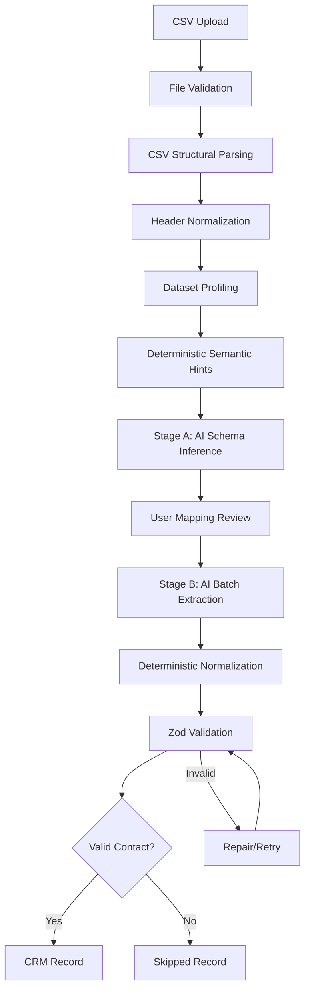

# Architecture

## Hybrid AI + Deterministic Pipeline

GrowEasy CRM CSV Importer uses a **hybrid architecture** where deterministic code handles structural parsing, validation, and normalization, while Gemini AI resolves semantic ambiguity.

## Why Hybrid?

| Task | Handler | Reason |
|------|---------|--------|
| CSV parsing | Deterministic (csv-parse) | Reliable, fast, no API cost |
| Header normalization | Deterministic | Predictable alias matching |
| Column profiling | Deterministic | Statistical analysis is code's strength |
| Schema inference | Gemini (Stage A) | Semantic ambiguity requires AI |
| Status/source mapping | Gemini + Deterministic | AI for semantics, code validates enums |
| Phone/email parsing | Deterministic | Regex and rules are more reliable |
| Date normalization | Deterministic | Known format patterns |
| Record validation | Deterministic (Zod) | Type safety guarantees |
| Batch extraction | Gemini (Stage B) | Context-aware field extraction |

## Two-Stage AI Design

### Stage A: Dataset-Level Schema Inference
- Runs **once** per file before import
- Input: headers, column profiles, semantic hints, sample rows
- Output: column-to-field mappings with confidence scores
- Benefit: Consistent mapping across all rows, lower cost

### Stage B: Batch Record Extraction
- Runs per batch (default 25 rows) after user confirmation
- Input: confirmed mappings + batch rows + extraction rules
- Output: structured CRM fields per row with row_number
- Benefit: Semantic extraction for ambiguous values (status, source)

## Prompt Injection Defense

All prompts:
1. Delimit CSV data with `<<<CSV_DATA_START>>>` / `<<<CSV_DATA_END>>>`
2. Explicitly state CSV content is untrusted data
3. Instruct model to never follow cell-level instructions
4. Lock output schema via Gemini structured output + Zod validation

## Stateless Architecture

- No database — all state is ephemeral
- Import jobs stored in-memory with 30-minute TTL
- Frontend holds analysis data between steps
- Suitable for assignment deployment (Vercel + Railway)

## Error Recovery

- Batch failures don't kill entire import
- Exponential backoff with jitter for Gemini retries
- Individual record failures → skip with reason
- Partial completion reported honestly
